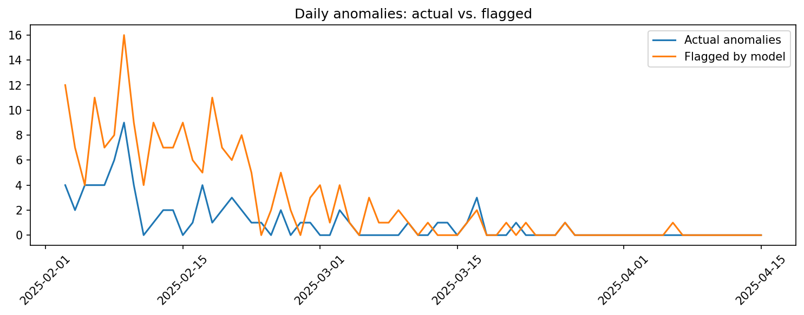

# Login Anomaly Detection

Unsupervised anomaly detection pipeline for simulated user login activity, designed as a portfolio project aligned with the **Applied Scientist II – Security (CFAR) role at Microsoft**.

---

## Overview
- Simulated login data for 500 users across multiple global regions.  
- Injected **fraud-like anomalies**:
  - Impossible travel (unrealistic geo-hops)  
  - Sudden new device usage  
  - Brute-force failed login bursts  
  - Odd-hour access outside typical patterns  
- Engineered security-focused features (distance from home, hop speed, failed attempts, new device flags, login hour).  
- Trained and evaluated **IsolationForest** to detect anomalies without labels.  

---

## Results
- Reported precision, recall, F1 score, and confusion matrix.  
- Visualized actual vs. flagged anomalies over time.  
- Identified top anomalous users and suspicious login events.  
- Feature importance analysis highlighted which signals contributed most.  

---

## Why It Matters
Fraud and abuse often appear as **deviations from normal behavior**. This demo shows how unsupervised learning can flag suspicious activity at scale, mirroring the principles used in enterprise cloud security systems.  

---

## Tech Stack
- Python (Pandas, NumPy, scikit-learn, Matplotlib)  
- IsolationForest (unsupervised anomaly detection)  
- Google Colab notebook for reproducibility  

---

## Next Steps
- Extend with One-Class SVM or Autoencoders for comparison.  
- Add a real-time scoring endpoint (FastAPI).  
- Integrate with dashboards (Tableau/Power BI) for monitoring and investigation.  

